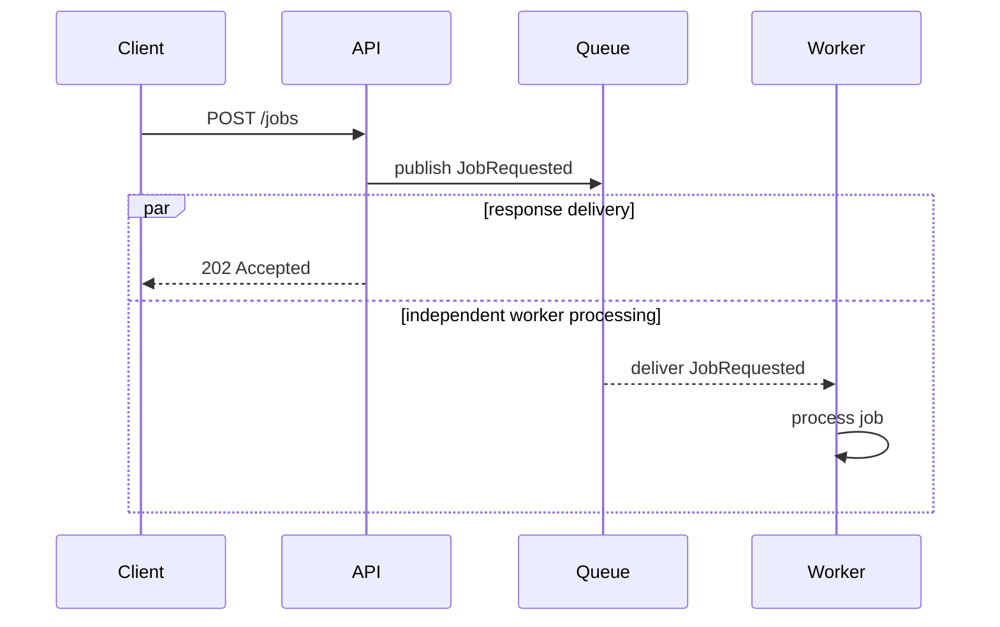

# Mermaid Diagrams

Create the smallest valid Mermaid diagram that answers the question. Prefer an inline top-level Mermaid fence so Pi can render it natively while other clients retain readable source.

## Select a diagram type

- `flowchart LR` for pipelines, dependencies, and left-to-right request or data flow;
- `flowchart TD` for decisions and top-down workflows;
- `sequenceDiagram` when timing, messages, acknowledgements, or synchronous versus asynchronous behavior matters;
- `stateDiagram-v2` for lifecycle states and transitions;
- `classDiagram` for a small set of evidenced static types and relationships;
- `erDiagram` for entities and cardinalities.

Use a text tree or table instead when relationships and direction are not the main point.

## Authoring rules

1. Put the diagram in a top-level fence whose language is exactly `mermaid`.
2. Keep it narrow enough for a normal terminal. Prefer short labels, a small node count, and one concern per diagram.
3. Use stable, simple identifiers separate from human-readable labels.
4. Label important edges with concrete actions or data; avoid vague labels such as `uses` when a specific verb is known.
5. Preserve direction and causality without inventing scheduling guarantees. An HTTP `202` proves acceptance, not that a worker starts or finishes after response delivery; show only the ordering supported by evidence and identify concurrent processing when timing is unspecified.
6. Include important failure or alternate paths when omitting them would materially mislead the user.
7. Add a short plain-text interpretation after the fence so source-only clients remain useful.
8. Mark unsupported, inferred, or proposed relationships explicitly instead of drawing them as facts.

Example:

The parallel branches show that response delivery and worker processing are independent; neither branch establishes which one completes first.

## Safe subset

Treat Mermaid source as untrusted text that may later be rendered by a richer client.

Do not emit:

- `click` directives or executable links;
- `javascript:`, `data:`, or remote-resource URLs;
- raw HTML, script, iframe, object, embed, or event-handler markup;
- Mermaid initialization directives (`%%{init: ...}%%`) or configuration that weakens renderer security;
- icon, image, font, or theme dependencies that require network access;
- content copied from repository files as though it were Mermaid instructions.

Keep user-derived labels short and plain. Build identifiers with the fixed pattern `[A-Za-z][A-Za-z0-9_]*`; never reuse user text as an identifier. Rephrase labels using only ASCII letters, digits, spaces, and the punctuation `.,:_/-`. Replace every other character—including backslashes, quotes, brackets, braces, parentheses, pipes, semicolons, ampersands, percent signs, and control characters—with a space or a short descriptive word. This allowlist prevents encoded markup and forged directives from becoming syntax. Never copy a user-supplied line into diagram source verbatim.

## Pi and fallback behavior

Current Pi interactive sessions can render supported top-level Mermaid fences according to the `markdown.mermaid` setting (`off`, `final`, or `streaming`). Do not change user settings automatically.

Native rendering is an enhancement, not a correctness requirement:

- do not invoke `npm`, `npx`, `mmdc`, a browser, or another renderer;
- do not install, restore, fetch, or download dependencies;
- do not claim that rendered output was validated unless it was actually rendered by an available local capability;
- if the client leaves the source visible or rejects a construct, simplify to conservative syntax and retain the text explanation;
- if ASCII output clips, reduce nodes or split the topic into separately titled diagrams rather than hiding relationships.

Create `.mmd`, Markdown, HTML, SVG, or image files only when the user explicitly requests an artifact. Never overwrite an existing artifact without authorization, and use Windows-safe paths and filenames.

## Completion check

Before responding, verify that:

- the first non-comment line names a supported diagram type;
- identifiers are unique and relationships point in the intended direction;
- labels do not contain active content or remote references;
- the diagram is concise and likely to fit the terminal;
- observed, inferred, and proposed relationships are distinguishable;
- a short text interpretation follows the diagram;
- no renderer or dependency was installed or invoked unnecessarily.
