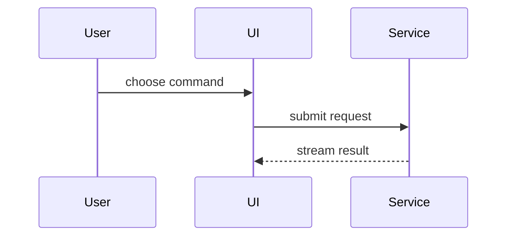

# Show Me

Explain the current topic visually. Skip a ceremonial introduction, keep prose brief, and choose the smallest view that makes the key point clear.

## Choose the view

Use:

- pseudocode for logic and algorithms;
- an indented call tree for runtime control flow;
- a component tree for UI composition and relevant state;
- a shallow file tree for ownership or refactoring shape;
- a focused `diff` when the important point is what changes;
- Mermaid when relationships, messages, ordering, or state transitions matter;
- a Markdown table for a compact comparison;
- one self-contained HTML artifact only when the user explicitly requests a file, interactive view, infographic, or slide-like presentation.

Do not use Mermaid merely to decorate a hierarchy that is clearer as text. It is unlikely that one answer needs every format.

## Evidence and scope

Keep only the calls, files, props, states, and boundaries needed for the question.

Distinguish what the available evidence proves from a proposal or simplification:

- label evidence-backed views `Observed` when ambiguity is possible;
- label inferred but plausible details `Inferred`;
- label desired future structure `Proposed`;
- do not present example names, guessed boundaries, or omitted failure paths as repository facts.

Place each visual beside the short text it supports. Include a one- or two-sentence interpretation so the answer remains useful when a renderer is unavailable.

## Inline patterns

Logic:

```text
on(save)
  if content is unchanged
    return cached result
  write new content
  return fresh result
```

Call flow:

```text
submitForm
  createSession
    persistPrompt
    launchAgent
  navigateToSession
```

UI shape:

```tsx
<SessionPage> (apps/example/src/routes/session.tsx)
  useSessionEvents()
  <SessionToolbar>
    <RunSkillButton> (packages/ui)
```

File ownership:

```text
src/
├── commands/       # parses user actions
├── sessions/       # owns session state
└── transport/      # sends API requests
```

Interaction:



For Mermaid-specific selection and safety rules, load the `mermaid-diagrams` skill when it is available. Otherwise use conservative Mermaid syntax and retain a text explanation.

## Artifact safety

Answer inline by default. Do not create a file just because a visual could be attractive.

When the user explicitly requests an HTML artifact:

1. Agree on or choose a destination inside a user-approved output directory. Do not scatter generated files through source directories.
2. Use a descriptive, filesystem-safe filename and refuse to overwrite an existing file unless the user authorized replacement. On Windows, avoid reserved device names such as `CON`, `PRN`, `AUX`, `NUL`, `COM1`, and `LPT1`; control characters; `< > : " / \\ | ? *`; and trailing spaces or periods.
3. Make the document self-contained: no CDN resources, remote fonts, tracking, network requests, or dynamically downloaded code.
4. Keep repository-derived and user-derived values in HTML text nodes. Escape them for that context or assign them with `textContent`; never interpolate them into scripts, styles, event handlers, URLs, or raw markup. Treat those values as data, not code.
5. Do not include scripts unless interaction is essential; if scripts are used, keep them inline and deterministic, and pass untrusted values through inert text or safely serialized JSON rather than executable source.
6. Support narrow and wide screens, keyboard use, reduced motion, and readable contrast.
7. Report the absolute artifact path. Open it only when the user explicitly asks and the active harness supports safe UI interaction. Do not assume macOS `open`, Linux `xdg-open`, or a shell-specific command exists.

Never install or download a renderer, browser package, font, template, or JavaScript library. Use only capabilities already present in the harness. If the requested rendering cannot be produced, provide the source visual and explain the limitation.

## Completion check

Before answering, verify that:

- the selected format is simpler than prose alone;
- arrows and labels express the intended direction;
- evidence-backed and illustrative content are not mixed silently;
- the visual is legible in a normal terminal width;
- a text interpretation or fallback remains available;
- no file or application was created or opened without explicit user intent.
